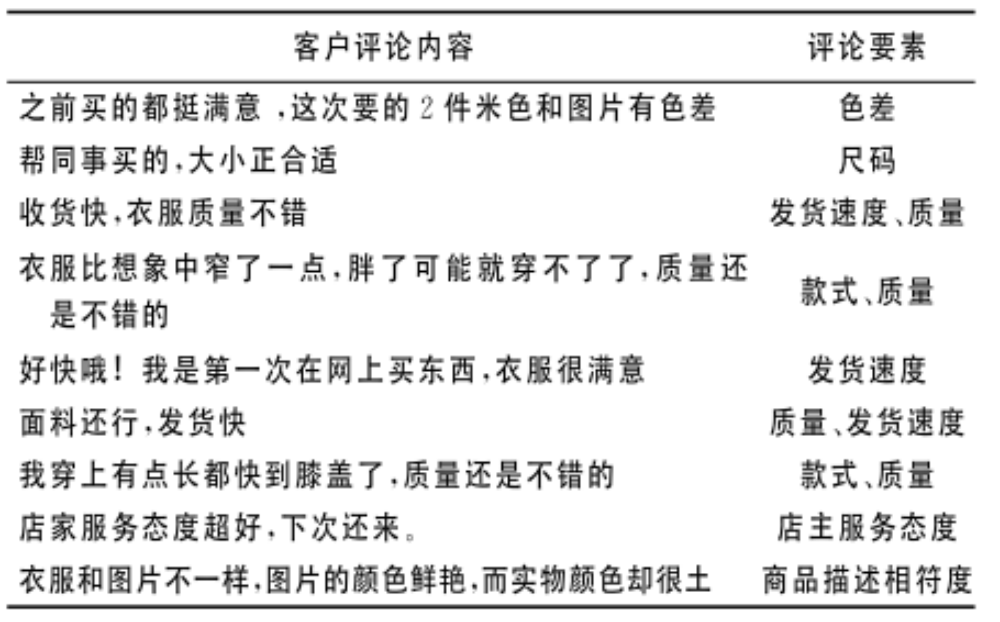
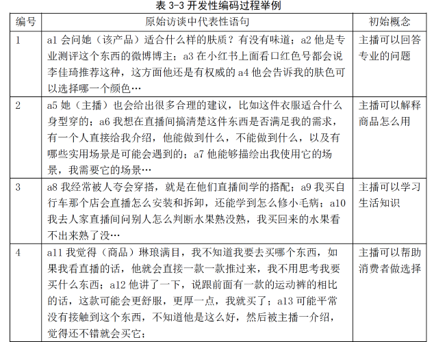
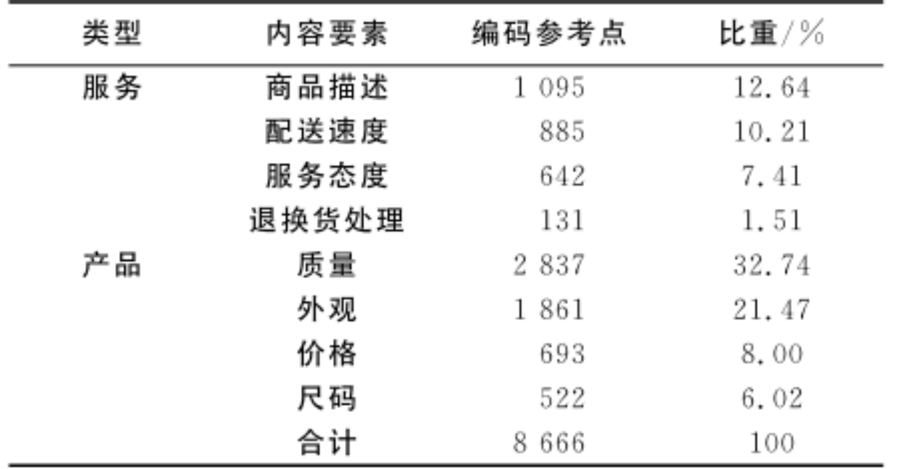
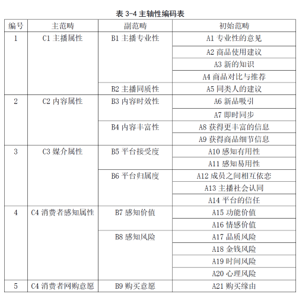

# 用户研究

## 用户

用户就是产品或者服务的使用者。

### 直接用户与相关用户 #card

* 用户按照与产品的相关性，可分为直接用户、相关用户。
* 交互设计主要关注直接用户。

#### 直接用户 #card

与交互系统直接相关，指偶尔或经常使用使用交互系统的用户。

#### 相关用户 #card

与交互系统间接相关，如管理者、客服、专家、开发人员、测试人员等等。

### 初学者、中间用户和专家级用户 #card

按照用户使用产品的过程，可分为初学者、中间用户和专家级用户。最重要的目标用户就是“中间用户”。

## 理解用户

理解用户时交互设计的首要过程，主要内容包括以下3方面：

1. 理解用户总群体的共性。
1. 理解用户子群体的共性。
1. 理解个体特性。

### 从人类学视角理解用户

人类学（anthropology）是从生物和文化的角度对人进行研究的学科，其核心概念是文化、社会、进化等等。

从人类学角度理解用户主要分为两个层面。

1. 理解用户在地域和文化方面的差异。
1. 用人类学研究方法理解用户需求。如田野调查、跨文化比较研究等等。

### 从认知心理学视角理解用户

认知心理学主要研究人认知的高级心理过程。

1. 认知过程的第一阶段：注意、感知和识别。
1. 认知过程的第二阶段：记忆。记忆分为短时记忆和长时记忆。
1. 认知过程的第三阶段：思维和决策。

### 从人机工程学视角理解用户

人机工程学（human engineering）是研究人与系统中其他因素之间的相互作用以及优化人类和系统效能的学科。

人机工程学使用人、机、环境三个系统要素进行研究。强调机器适应人，而不是人适应机器。人机工程学学产品多追求可用性和用户体验。

## 如何识别用户需求

用户需求包含两层含义：need（需要）和want（想要），前者多指物质层面的需要，后者多指精神层面的需要。

### 用户需求

从用户的角度，还可分为显性需求、隐性需求、潜在需求。

1. 显性需求：用户明确提出的基本要求。
1. 隐性需求：用户没有明确提出，但当这种需求的形式出现时，用户能认可和接受。
1. 潜在需求：用户由于某种条件被压制的需求，尚无明确提出。

了解用户需求就是了解用户的需要和期望，确定用户为了实现目标而可能采取的行为。只有了解用户需求，才有可能设计出满足用户需求的产品。

### 用户选择

对于显性需求，一般可选择直接用户。对于隐性需求，可选择相关领域的专家或营销人员。

对于用户观察或产品评估研究对象一般选5-10人，不同用户类型的选择比人数更为重要。本质上是抽样。

Tips：在作品设计稿中最好提供用户选择矩阵。即按照用户的使用程度、系统相关性的二维矩阵选择用户样本。

### 用户研究的常见内容

1. 背景：年龄、职业、喜好、学历和经历等。
1. 目标：用户使用产品的目的是什么？用户最终想要得到什么结果？
1. 行为：用户与产品之间采取什么样的交互行为来达到目标？
1. 场景：用户在什么情况使用系统？
1. 喜好：用户喜欢什么？不喜欢什么？讨厌什么？
1. 习惯：用户的操作或使用习惯。

## 用户研究方法

App 其实是一个个满足特定需求的功能合体。互联网产品设计需要建立在用户需求的基础上，因此用户研究必不可少。

研究方法可以分为定序研究方法和定量研究方法。

用户研究可以通过观察法、问卷调查法、实验法、焦点小组访谈、深度访谈、文献研究等多种方式进行。

### 焦点小组访谈 #card

**焦点小组访谈**(focused interview)，又称焦点访谈法，就是采用会议的形式挑选一组具有代表性的消费者或客户，在主持人的支持下，就某个专题进行询问，从而获得对有关问题的深入了解。

誉为二十世纪最伟大的社会学家之一的哥伦比亚大学社会学系教授罗伯特·金·默顿和他的同事, 对焦点访谈的理论和运用, 作出了开创性的贡献。

* 1941年，默顿改进保罗·拉扎斯菲尔德的实验。
* 1946年，默顿和坎德尔在《美国社会学研究》上发表“焦点访谈”学术论文。

#### 焦点小组访谈的特征

焦点访谈的特性, 是研究者预先设计好主要的研究问题, 在访谈提要的指导下, 研究者组织讨论, 被访者是有关事件的经历者、知情人或者具有自己观点的人士, 他们在访谈中表达自己的主观感受。

#### 焦点小组访谈实施步骤

1. 准备
1. 实施
1. 分析

#### 调查准备工作

* 确定调查对象（3-4个小组，每组6-8人）；
* 确定提问方式（结构式或者开放式）；
* 制作话题一览表；
* 确定会场、时间、报酬、备品等细节。

#### 组织座谈

* 首先由主持人导入问题；然后由小组成员就某个问题轮流发言。
* 主持人需要注意：调查目的的理解；营造容易对话的氛围；让调查对象理解提问的意图；时间的管理；改变问题的提法，以补充发言少的项目。

#### 整理分析

* 制作小组成员特征一览表；
* 整理每个问题的发言，合并同类型发言；
* 进行深入分析。

### 访谈资料的质性分析

狭义的**质性分析**是指对所获得的原始资料进行编码、归类、解释并概括资料所呈现的意义。质性分析的任务可分为两个层次：资料整理和深入分析。前者是资料“打散”、“重组”的过程。后者则需要寻找不同资料之间的关系，将资料进一步聚焦、浓缩，形成一定的假设。

#### 回顾资料

首先对相关定性资料进行全面的回顾，熟悉资料，准确理解局部，对材料进行整体把握。

#### 筛选相关资料

通过做批注、做笔记、直接摘引等方法，对与研究目的相关的或其他有用的资料进行筛选，以便之后重点分析。

#### 分类和归类

首先对资料进行编码，然后将相同的资料归在一起进行分析。**编码**就是针对同一主题、类别或概念的资料使用同样的号码标识出来的过程。**编码是定性资料分析的核心过程**。

编码说明：

1. 分类的标准可以灵活调整，不一定是事先就有的。
2. 类别的命名要尽量用被访者的语言（**本土概念**）。避免过度概括。
3. 开始编码的范围可以较宽，随后不断缩小范围，直到**编码出现饱和**。

##### 编码案例一

> 问：你比较看重论坛的哪些方面？
> 答：第一个就是人气吧，就是上网的人比较多，注册会员比较多。那么大家都比较喜欢这个，就是有共同的爱好，在网络上交流。
> 从以上表述中提取出“人气旺”这样一个概念。

##### 编码案例二

##### 编码案例三

##### 归类案例一

在编码的基础上，研究者可以将相同的资料整理在一起进行归类。

##### 归类案例二

### 文献研究

通过对已有文档的阅读、整理和对比，获取最新资料。竞品分析的多数内容可通过文献研究方法完成。

### 观察法

利用记录、拍照、视频或录音等技术手段来获取用户使用现有产品或新产品原型的行为或语言等信息。

## 用户研究训练任务

1. 使用合适的研究方法，完成参赛作品目标用户的需求研究。
1. 参考网络中优秀竞品分析报告，完成参赛作品竞品分析，下周汇报。
