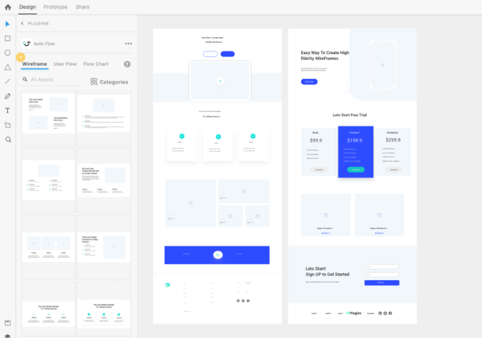

# 组件

## 组件基础

**组件**是可以重复使用的对象。组件用于创建和维护重复元素，同时针对不同的上下文和布局可拥有同一元素的多个版本。

### 创建组件

创建组件的途径有：

1. 单击“`属性检查器`”的“`组件`”部分中的 `+` 图标。
1. 在“`资源`”面板的“`组件`”部分中单击 `+` 按钮。
1. 右键单击对象并选择“`制作组件`” （快捷键为`Ctrl/CTRL+K`)。

第一次在 XD 中创建组件时，此组件将成为**主组件**，主组件用左上角的**绿色实心菱形**表示。我们可以像编辑任何其他元素一样编辑组件。

### 使用组件创建实例

主组件的每个副本都称为**实例**。组件实例用左上角的**绿色空心菱形**表示。对主组件进行更改时，系统会对所有实例应用相同的更改。

**覆盖**是仅适用于该实例，而非主组件的独特更改。如果我们更改实例中的属性，XD 会将该属性标记为“覆盖”。我们可以在不断开与其主组件连接的情况下，覆盖实例属性。

如果要取消链接单个组件实例，请使用上下文菜单中的“`取消组合组件`”选项。但是，如果要取消链接画布上的所有实例，请使用“`资源`”面板中的删除选项。

### 编辑主组件

XD 没有用于编辑主组件的专用视图。编辑主组件时，可在画布上编辑。

编辑主组件时，所有实例都会更新，除非所有实例都包含该特定属性的覆盖。

注意：旋转和不透明度属性不会从主组件传播到实例。

编辑主组件的方式有以下三种：

1. 右键单击画布上的实例，然后选择`编辑主组件`。
1. 在“`资源`”面板中右键单击组件，然后选择“`编辑主组件`”。
1. 在`属性检查器`的在`组件`部分，选择`默认状态`旁边的`编辑铅笔`图标。

### 覆盖组件实例

覆盖是仅适用于该实例，而非主组件的独特更改。若要清除覆盖并重置主组件，请右键单击实例，然后选择“`重置为主状态`”。

可以覆盖组件实例中的文本、位图、大小、外观、布局和结构（可以在实例中增减元素）。

## 嵌套组件

**嵌套组件**是另一个组件内部的组件。**外部组件**是内部具有另一个组件的组件。

使用嵌套组件可构建更健全的设计系统。

### 创建嵌套组件

要创建嵌套组件，可使用以下这些方法中的任意一种：

1. 复制组件实例并将它粘贴到组，然后将它转换为组件。
1. 复制组件实例并将它粘贴到已存在的组件中。
1. 深入到组件的某个部分，并将这个部分转换为组件。

可创建其中嵌套了多个组件的组件。

注意：请勿将组件嵌套在自身中。这可能因组件引用自身而导致组件无效。

注意：嵌套组件不能是主组件。因此，如果需要更改主组件，请右键单击嵌套组件，然后选择“编辑主组件”。

## 组件状态

**组件状态**允许我们保存组件的不同变体，以便每次重复使用。在主组件上创建的状态在该组件的所有实例中都可用。

### 添加组件状态

在创建了组件之后，“`属性检查器`”会列出具有“`默认状态`”的组件。在`设计模式`下，单击`属性检查器`中主组件的`默认状态`旁边的 `+` 按钮，然后选择`悬停状态`，可以创建悬停状态。

如果要创建具有交互式切换行为的组件，如切换组件、单选按钮，可以选择`切换状态`。

还可以选择创建默认状态下没有交互性的`新建状态`。

### 管理组件状态

为组件创建状态之后，选择组件并通过“`属性检查器`”在各种状态之间切换。在“`属性检查器`”中双击组件状态名称，可以修改名称。右键单击组件状态并选择“`删除`”，可以删除状态。

### 为组件不同状态添加交互

在“`原型`”模式下，我们可以使用`点击`、`悬停`、`按键`和`游戏手柄`以及`语音`触发器连接组件状态之间的交互。连接组件状态之间的交互类似于连接画板之间的交互。主要区别是在连接组件状态之间的交互时，选择状态而非画板作为目标。

我们可以为同一个组件状态定义多个交互。

# 版面

## 响应式调整

在 Adobe X 中设计网站时，重要的是要考虑内容是在不同设备（手机、平板、台式机等）上显示。长期以来，设计师们为网页设计中的每个页面制作了多个不同尺寸的画板，这意味着要在不同尺寸的画板上，调整内容大小。

为了解决这个问题，Adobe XD 提供了名为**响应式调整大小**的特性。通过响应式调整大小，XD 可以自动预测可能需要哪些约束应用，然后在调整对象大小时自动应用这些约束。

### 响应式调整大小十字线

当调整大小时，被调整大小的对象上会出现**粉色十字线**。这些十字线表示哪些约束规则应用于组。XD 提供了一种直观的上下文方式，让用户了解响应式调整大小功能如何与手动约束协同工作。

### 响应式调整大小和组

在调整大小之前，我们可以为相似的对象分组，从而在它们之间建立关系。默认情况下，XD 会将已分组的对象保留到一起，并支持我们通过已使用的组织机制在项目中建立层次结构。调整大小后，已分组的对象将聚在一起。

### 手动编辑约束

如果我们对响应式调整大小的结果不满意，则可以`手动`编辑约束规则。通过放置手动约束，我们可以明确判断在使用对象中的图层调整组件、画板或组的大小时对象的行为方式。

还可以关闭`响应式调整大小`，手工设定缩放比例。

### 响应式调整画板大小

默认情况下，响应式调整大小对画板关闭，但我们可以打开它以对画板启动`响应式调整大小`。

## 固定内边距

通过 Adobe XD 可以在带状态的组或组件上设置固定的内边距值，这样可以减少在创建按钮、下拉菜单、工具提示或模式对话框时所产生的重复工作。响应式调整大小是在调整整个组的大小时作出行为，而内边距是在更改组中的内容时作出行为。

内边距在原型设计过程中充当徽标周围或更大按钮点击区域中的安全空间。要设定内边距，请从“`属性检查器`”中，切换`边缘填充量`按钮，根据设计需求，设置“`边缘填充量`”或“`所有填充量`”的值。

## 堆叠

Adobe XD 中的**堆叠**使组中的对象能够定义它们之间的固定空间。我们在堆叠中调整对象的大小、对其重新排序或修改对象时，XD 会自动保留对象之间已定义的空间。

堆叠可轻松地应用于组件，并对按钮、菜单、下拉列表和基于卡片的布局进行自动布局和编辑。

### 启用堆叠

注意：堆叠只对组起作用，不在组中的对象无法启用堆叠。

在`属性检查器`的响应式调整大小控件中，选中`堆叠`复选框。XD 会根据组或组件的结构自动确定堆叠方向。但是，如果要更改堆叠方向，请在“属性检查器”的“堆叠”选项中选择“垂直”或“水平”。

启用堆叠时，XD 将执行以下操作：  

- 自动识别背景（“图层”面板中位于底部的组或形状，与组中的所有对象在画布上重叠）；
- 启用和计算填充值；
- 确定堆叠方向：“垂直”或“水平”；
- 对重叠的元素进行分组以保留布局；并
- 定义和固定元素之间的间距值。

### 编辑堆叠

选择堆叠组或组件中的对象，并将鼠标悬停在空格上。粉红色突出显示表示堆叠中对象之间的间距。单击并拖动突出显示部分即可编辑对象之间的间距。

选择整个堆叠并按住键盘上的 `S` 键也可调整堆叠中指定元素之间的间距。若要使得堆叠中的间距保持一致，可在拖动时使用 `Shift` 或 `Shift + S`。

选择要调整大小的对象，堆叠中的其他对象会自动移动以保留对象间的相对间距。使用**自动调整高度文本**可动态调整堆叠中文本的高度，而不改变其宽度。
。

在堆叠中复制元素（`快捷键为 Ctrl+D`），会保持元素间距并将其放在选定元素下。

### 对堆叠元素重新排序

创建和修改堆叠元素后，还可对其进行重新排序：

- 选择堆叠元素，并在画布上沿着堆叠方向拖动它们。
- 使用 `Ctrl+]` 和 `Ctrl+[` 在堆叠中上下移动，使用 `Ctrl+Shift+]` 和 `Ctrl+Shift+[` 将选中的元素移到堆叠中的第一个或最后一个。上下文（右键单击）菜单中也提供这些命令。
- 堆叠元素的新位置用粉红色框突出显示。要在重新排序时保持对齐，需按住 `Shift` 键将堆叠元素锁定在拖动方向上，并保留其原始对齐方式。

### 堆叠背景

从堆叠中，选择要用作背景的元素，右键单击并选择“`设为背景`”或“`替换背景`”。所选元素将移动到堆叠的最后一个位置，并将调整大小以适合堆叠和填充值的大小。
  
### 嵌套并重新排列堆叠

当相互嵌套堆叠时（例如，将水平堆叠嵌入垂直堆叠中），我们可以实现良好定义且易于编辑的布局，可以嵌套不限数量的堆叠。

### 组件和状态中的堆叠

可以在组件中应用堆叠和填充，应用于主组件的堆叠将自动应用于其所有实例和状态。

## 视频和 Lottie 动画

通过视频和 Lottie 动画，能够为 UI 增加更为丰富和细致的动态效果。

### 视频

通过 XD 可导入视频、调整基本视频设置、缩略图和控制播放。

Tips：视频和 lottie 动画作为交互对象时，交互`触发`条件会增加`播放完毕`选项。

注意：在目前的版本中，导入的视频需要满足以下条件：大小不超过 15M，分辨率不超过 4K，音频解码为 AAC，编解码器为 H.264，文件格式为 MP4。

### Lottie 动画

[Lottie](http://airbnb.io/lottie/#/) 是 Airbnb 开源的一套跨平台的完整的动画效果解决方案，设计师可从 Adobe After Effects 使用 Bodymovin 插件导出 JSON 文件的轻型动画。与动画 GIF 和 PNG 等格式相比，Lottie 文件更小。关键在于开发人员还可以在其代码中重用 Lottie 文件。

#### 在 XD 中使用 lottie 动画

Lottie 动画是类似于视频的一种特殊的可播放的资源，因此需要在使用其通过 XD 可导入 lottie 文件并控制 lottie 播放，并可在原型交互中与其它交互结合使用。例如在动画播放完毕后执行其它交互。

#### 在 XD 中使用 lottie 动画的限制

1. 导入的文件需小于 15M；
1. 如果视频设置为自动播放，则 lottie 将不会自动播放。
1. 如果启动了其他原型制作触发器，则 lottie 将停止。

# 原型

## 原型的概念

**原型**是一种让用户提前体验产品、交流设计构想、展示复杂系统的方式。就本质而言，原型是一种沟通工具。

原型是需求和功能的具象化表达，可以辅助产品经理与领导、交互、UI和技术的沟通产品思路。原型的目标在于清楚的表达产品的设计理念和功能的执行逻辑，

原型为何如此重要？因为原型通常拿来给真正的用户测试产品用的，有助于收集有关设计的可行性和可用性。早期的原型测试能够节省巨量的开发成本和时间。

### 线框图

**线框图**是产品设计的低保真呈现方式。线框图描绘的是页面功能结构，它不是设计稿，也不代表最终布局，线框图最主要的作用是描述功能与内容的逻辑关系。搜集团队和客户的想法和意见，尽量体现到线框图的设计中去。

### 原型图

**原型图**比线框图更加真实、细致，是最终产品的模型或者模拟。原型是必须囊括产品该有的美学特征，并且尽量贴合最终版本。点击相应的元素之后，原型也应出现对应的交互回馈。

## 创建交互式原型

切换到**原型模式**（快捷键为`Alt+2`），按所需的导航顺序连接各个屏幕以及整理多个**流**，将 2 个或更多画板连接在一起。单击预览按钮可预览您的原型（快捷键为`Ctrl+Enter`）。

Tips：按下`Alt`键，可以临时隐藏原型视图中的连线。

### 设置主页屏幕

**主页屏幕**是您的应用程序或网站的第一个屏幕。默认情况下，“主页”屏幕会被设置为第一个添加连线的画板。

单击要设置为“主页”屏幕的画板。左上角会出现一个灰色的主页图标。单击“主页”图标。它会变成蓝色，表示该画板现已成功设置为“主页”屏幕。

### 添加交互

**交互由触发条件和操作类型构成**。

选择某个对象，在`原型`界面，添加`交互`，设置`触发`条件和`操作`类型，即可完成交互设置。一个对象可以添加多个不同的交互。

触发条件有：“`点击`”、“`拖动`”、“`悬停`”、“`时间`”、“`按键和游戏手柄`”、“`声音`”或“`播放结束`”。

操作类型有：“`过渡`”、“`自动制作动画`”、“`叠加`”、“`滚动至`”、`“上一个画板`”、“`音频播放`”、“`语音播放`”、“`视频播放`”以及`“Lottie 播放`”。

注意：`点击`、`拖动`、`悬停`和`时间`触发器只能应用一次，而`语音`、`按键和游戏手柄`可应用多次。

### 设置多个流

通过多个流，可从同一文档或在同一文件中创建和共享一个设计的多个版本，并在许多原型或设计规范间利用同一组画板。每个流均保留自己的一组连线和共享详细信息，这样无需每次都撤消再重新进行所有设置，即可作出更改并重新发布。

## 自动制作动画

借助交互`操作`中**自动制作动画**功能，我们可以创建沉浸式过渡，以便呈现内容在画板之间的移动。

如果对象的图层名称和组均匹配，系统会自动对**发生变化的且支持过渡效果**的属性进行动画处理。这些属性有边框大小、边框短划线、边框间隙、不透明度、圆角、位置 (X/Y)、大小 (W/H)、旋转、文本大小、字符间距、段落间距、行间距、路径。

如果要构建水平或垂直滚动效果的原型，请使用[滚动组][滚动组]或者[重复网格][重复网格]。

## 使用语音和播放创建交互

切换到原型模式（快捷键为`Alt+2`），选择要添加语音交互的对象，在`属性检查器`中的`触发`器中选择`声音`，输入**英语文本**形式的语音命令。在预览时按住`Space`键进入语音交互模式。

`交互`操作中的`类型`可以设置为`播放`，然后输入文本形式的语音内容，即可设置播放交互。

也可以添加音频文件，然后选择交互`类型`为`音频播放`，达到使用自定义音频文件进行交互的目的。

---

Tips：建议使用语音命令和语音播放时要将它们和其他视觉交互一起使用，请使用语音触发器从一个画板过渡到第二个画板。然后在第二个画板上，使用时间触发器进行语音播放。使用语音触发时，这样可以结合视觉响应和语音播放。

注意：Adobe XD 官方资料显示语音及播放命令需要需要接入互联网，且仅支持英语、德语、日语、朝鲜语、中文、西班牙语、巴西葡萄牙语和法语。经测试目前暂不支持中文。

## 创建定时过渡

通过`时间`触发器，您可以根据`时间延迟`和`持续时间`在画板之间创建过渡。

您可以将时间触发器与操作结合使用以打造一系列效果，例如倒计时、循环动画、进度条等。以下是时间触发器与自动制作动画结合使用的示例。

## 添加叠加

如果要模拟下拉列表、上划键盘等等效果，可以使用**叠加**操作。

动画选项中的溶解、滑动都可以通过拖动位置指示方块（见下图）指定叠加在上层的内容所在准确位置。

### 叠加效果的限制

注意：目前版本中的`叠加`操作，其触发条件只能是`点击`、`拖移`、`按键和游戏手柄`、`语音`。

`动画`类型，只能在`滑动`和`溶解`中进行选择。

## 创建锚点链接

通过`交互`操作中的`滚动至`选项，可以创建**锚点链接**交互效果。在设计长页面表单或长文本文章时，使用锚点链接可加速导航并提升可用性。

# 插件

## 插件的安装

Adobe XD 具备由 Adobe 和第三方开发人员提供的插件和应用程序集成，可自动完成复杂和重复的任务，从而增强我们的设计工作流，并实现与外部工具和服务的深度集成。

要查看和安装插件，请使用以下任一选项：

- 在主页屏幕上，选择“`加载项`”>“`插件`”以启动“`插件`”面板。
- 单击“`工具栏`”上的“`插件`”图标，然后选择“`发现插件`”，或单击“`+`”图标以启动“`插件`”面板。

从“`插件`”面板中，我们可以查看、启动、安装和更新插件。

## 常用插件

下面介绍几个常用插件：

### StockSolo

StockSolo 是 Adobe Photoshop、Illustrator、InDesign 和 XD 的插件，可将大量免费的照片带入设计软件中的面板。这些免费的照片由 Unsplash、Pexels 等等免费素材图库提供，有超过 320 万张图像可供选择使用，使用非常的简单可以搜索图片然后直接拖拽到使用界面。

### AutoFlow

AutoFlow 能帮助设计者快速设计线框图、流程图。

### iconscout

iconscout 插件提供数量庞大的图标、插图、3D 素材。多数资源有免费和收费两种。

### Vizzycharts

Vizzycharts 插件能基于真实数据生成折线图、柱状图、饼图。

### AutoGrid

为画板或者形状增加可定制纵向栅格，扩展了 Adobe XD 的网格功能。

### 颜色相关插件

- Adee accessibility check 插件可用于检查颜色对比度是否符合要求。
- Color scale 可用于指定颜色的不同色阶。
- Depely colors 提供了快速的配色工具。

### Web Export

Web Export 插件能将 XD 画板导出成HTML、CSS、JS文件，方便对接开发工作。

