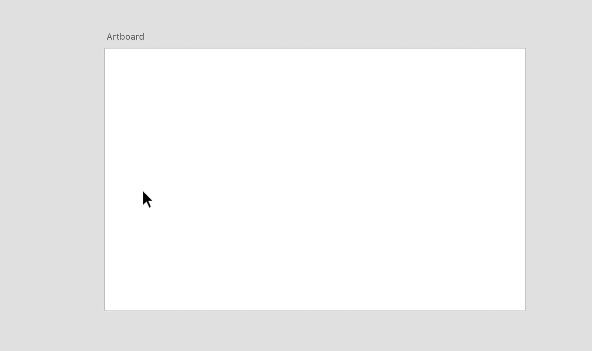
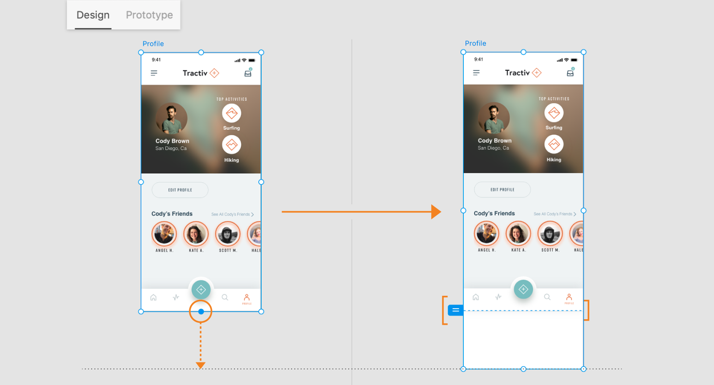
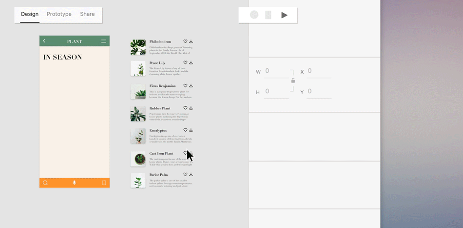

# 画板与图层

## 使用画板

**画板是应用程序中的屏幕或网站中的网页的隐喻**。它可以简化设计流程，并在一个文档内创建适用于多种屏幕大小的交互式设计。

### 创建新画板

1. 可以使用主页屏幕中的预设画板大小创建画板。
1. 还可以使用画板工具（快捷键为`A`), 创建画板。
1. 还可将 Photoshop 或 Illustrator 中的现有画板导入 XD，而不必重新创建画板。

### 管理画板

双击画板标题，可以重命名画板。拖动画板边缘上显示的圆形手柄，可以调整画板大小。选择画板并按 `Ctrl/Ctrl+D`，可以复制画板。选择多个画板并单击“`属性检查器`”中的“`对齐与分布`”，可以对齐多个画板。拖动画板可以重新排列画板。

## 使用参考线和网格

进行设计时，可以使用参考线排列对象或管理画板上元素之间的间距。网格可用作一个框架，我们可以在该框架上组织设计元素（图像、字形、段落）并确保布局的对称性。

### 创建参考线

将鼠标悬停到画板的边框，直到显示图标，就可创建参考线。

### 参考线的编辑

要从画板复制参考线，请选择画板，单击“`查看`”>“`参考线`”>“`复制参考线`”。选择画板，选择`查看`>“`参考线`”>“`粘贴参考线`”（快捷键为`Ctrl+V`）即可将参考线粘贴到画板的对应位置。

要删除参考线，请单击参考线并将其拖出画板。

使用 `Ctrl+;` 在 Windows 中隐藏参考线。使用 `Ctrl+Shift+;` 在 Windows 中锁定参考线。

### 智能参考线

默认情况下，智能参考线处于启用状态。移动对象或画板时，智能参考线允许我们通过对齐来相对于其他对象和/或画板对齐、编辑和变换对象或画板。

### 测量距离

单击对象并按下 `Alt` 键 （在 Windows 上），可以测量对象与画板之间的距离。

单击对象，然后将鼠标悬停在其他对象上，按下 `Alt` 键，Adobe XD 就会测量两个对象的邻近边界之间的距离并显示测量值。

### 使用网格定位对象

**版面网格**是列网格，在对齐设计对象或针对不同屏幕大小进行设计时非常有用。 使用`Ctrl+Shift+'` 在 Windows 中隐藏或者显示布局网格。

**方形网格**具有水平线和垂直线，用于在设计移动应用程序或图标时精确调整大小和对齐对象。 使用`Ctrl+'` 在 Windows 中隐藏或者显示方形网格。

## 创建可滚动画板

有时画板的长度不足以容纳我们的内容。通过根据设计需求加长画板并选择可滚动画板以适应不同的设备尺寸。

画板中的元素，还可根据需要选择`滚动时固定位置`：将设计元素固定到固定位置，避免它们随内容一起滚动。

## 滚动组

**滚动组**是独立于画板其余部分而单独滚动的区域。

### 创建滚动组

在“`设计`”模式中，选择要转换为滚动组的对象。然后单击“`属性检查器`”中的`垂直滚动`图标进行上下滚动。视区自动调整其尺寸以提供即时预览体验。还可以使用 `Shift+Ctrl+V`（在 Windows 中），以创建垂直滚动效果。

类似的，还可以创建`水平滚动组`以及`水平和垂直滚动组`。

## 图层

使用快捷键`Ctrl + Y`或者单击工具栏中的图层图标来访问图层。

在 Adobe Photoshop 中图层就如同堆叠在一起的透明纸，我们可以透过图层的透明区域看到下面的图层。Adobe XD 中的图层与 Adobe Illustrator 和 Adobe Photoshop 中的图层存在一些共同特性（如图层模式、透明性），但也有区别，例如当某个画板正在处理时，图层面板中只会显示该画板中的图层。

当未选择任何内容时，“图层” 面板会列出在文档中找到的所有画板，通过图层中的列表，我们可以选择、隐藏和锁定内容以及更多对内容的操作。

### 对画板和图层内容重新排序

默认情况下，当我们向画板添加内容时，每个新对象都位于先前对象的顶部。对象的这种顺序称为**堆栈顺序**。

可以在图层列表中对画板的堆栈顺序进行调整。重新排序图层并不会影响画板的位置，主要用来实现意义、逻辑上的组织。

不在任何画板上且被放置在粘贴板上的对象将在“`图层`”面板中的“`粘贴板`”下编组。

### 使用图层面板选择内容

可以直接在图层列表中选择内容对象，进而进行复制、删除、重命名、编组、导出、创建组件等等操作，在多数情况下，效率高于直接在工作区查找。

### 使用图层锁定或隐藏内容

通过图层列表中对象对应的图表，可以锁定、隐藏对象。当一个对象被锁定的时候，其不能被移动、删除或者编辑。可以再次按`Ctrl+L`取消锁定状态。

### 在图层面板中搜索、过滤

我们可以搜索 “图层” 面板以仅显示包含关键字的相关图层和画板，也可以按文本、形状和图像类别过滤面板中显示的图层。
